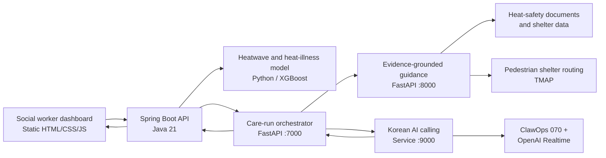
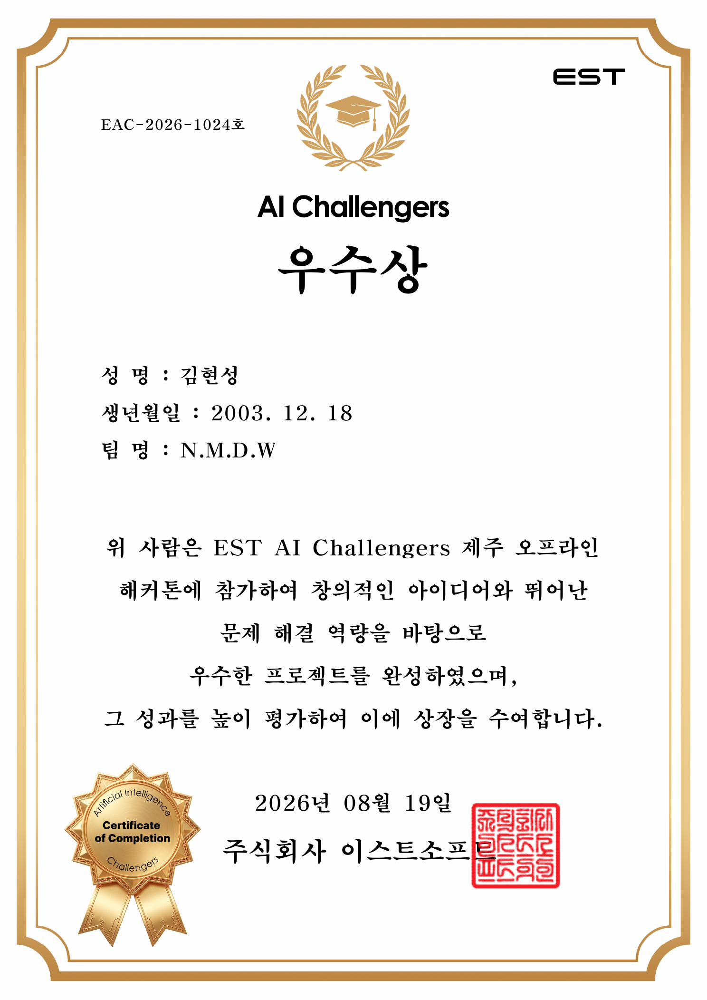

<div align="center">

# ANSIMON (안심온)

### Predictive heatwave care that reaches older adults before risk peaks

[](https://www.estsoft.ai/)


**Team N.M.D.W · EST AI Challengers Jeju Offline Hackathon · 2026**

</div>

ANSIMON is a proactive heatwave-care prototype for social workers and older adults. It predicts next-day heat risk, grounds personalized guidance in reviewed evidence, recommends a walkable cooling shelter, places a Korean AI care call, and turns the result into structured follow-up information.

> This repository is the consolidated, English-documented edition of the eight public repositories originally maintained by the [N-M-D-W GitHub organization](https://github.com/N-M-D-W). Seven repositories contained project files; the eighth, `ansimon-total`, was empty at the time of consolidation. Default and non-default branches were audited, with branch-only artifacts preserved under `archive`. Exact source revisions are recorded in [Source Repositories](docs/SOURCE_REPOSITORIES.md).

## Why ANSIMON

Heatwave response often starts after conditions become dangerous. ANSIMON shifts the workflow earlier:

1. Predict the time window when heat risk is likely to peak.
2. Generate guidance only from traceable heat-illness evidence.
3. Recommend a cooling shelter using pedestrian travel time, not straight-line distance alone.
4. Call the older adult before the peak and ask a small set of actionable questions.
5. Return structured results so a social worker can prioritize human follow-up.

The direct operator is a social worker; the intended beneficiary is an adult aged 65 or older. ANSIMON is a hackathon prototype, not a medical device or emergency-response service.

## System Architecture



## Repository Map

| Component | Path | Stack | Responsibility |
| --- | --- | --- | --- |
| Backend | [`components/backend`](components/backend) | Java 21, Spring Boot, JPA, Flyway | Profiles, forecasts, guidance runs, call outcomes, persistence, and external-service configuration |
| Dashboard | [`components/dashboard`](components/dashboard) | HTML, CSS, JavaScript | Social-worker dashboard and older-adult management UI |
| Integrated care flow | [`components/integration`](components/integration) | Python, FastAPI | Validates contracts and coordinates RAG, calling, and backend callbacks |
| Heat-risk model | [`components/heatwave-ml`](components/heatwave-ml) | pandas, scikit-learn, XGBoost | Next-day Seoul heatwave and older-adult heat-illness risk scoring |
| Standalone RAG | [`components/rag`](components/rag) | Python, TF-IDF, Pydantic, FastAPI | Document ingestion, retrieval, prompting, schemas, and evidence verification |
| Shelter routing | [`components/shelter-routing`](components/shelter-routing) | Python, aiohttp, TMAP | Finds the most practical nearby cooling shelter by pedestrian route |
| Standalone voice | [`components/voice-calling`](components/voice-calling) | Python, ClawOps, OpenAI Realtime | Places Korean preventive-care calls and structures call outcomes |

`components/integration` is the recommended end-to-end Python snapshot. The standalone RAG and voice directories are retained because they preserve their original component repositories and documentation.

## Core Safety Decisions

- **Consent is fail-closed.** No call is created when consent is absent or unrecognized.
- **Evidence is mandatory.** Guidance generation is blocked when citations are missing, fabricated, or inconsistent.
- **Routing uncertainty is visible.** A failed TMAP route or an excessive walking time is marked for human review instead of being presented as certain.
- **Unknown answers remain unknown.** The system does not infer responses that were not clearly provided during a call.
- **Personal data is minimized.** Phone numbers are kept out of RAG payloads and logs; transcripts are represented by references rather than copied into result payloads.
- **Humans remain in control.** Emergency symptoms and mobility needs become follow-up signals for a social worker; the AI does not diagnose or independently dispatch emergency services.

## Quick Start

### 1. Run the integrated Python services

Prerequisites: Python 3.11 or newer. External API keys are optional for deterministic RAG tests and dry runs, but real calls require ClawOps and OpenAI credentials.

```bash
cd components/integration
python -m venv .venv

# macOS / Linux
source .venv/bin/activate

# Windows PowerShell
# .venv\Scripts\Activate.ps1

pip install -r requirements.txt
cp .env.example .env
python -X utf8 run_all.py
```

In a second terminal:

```bash
cd components/integration
python -X utf8 run_demo.py --check
python -X utf8 run_demo.py --file samples/01_high_shelter.json --dry-run
```

Never use a real older adult's phone number for a demo. Use a fictional profile and a consenting team member's number only.

### 2. Run the dashboard

```bash
cd components/dashboard
python -m http.server 5500
```

Open `http://localhost:5500/index.html`. The dashboard expects the backend at `http://localhost:8080`; override it with `?api=http://host:port` when needed.

### 3. Run the Spring backend

```bash
cd components/backend

# macOS / Linux
./gradlew bootRun

# Windows
# gradlew.bat bootRun
```

Copy `.env.example` values into your shell or IDE run configuration before enabling external integrations; Spring Boot does not automatically load that file. The backend requires MySQL and defaults the Spring AI vector store to `none`.

## Local Ports

| Port | Service |
| ---: | --- |
| `5500` | Static dashboard |
| `7000` | Integrated care-run orchestrator |
| `8000` | RAG and guidance API |
| `8080` | Spring Boot backend |
| `9000` | Voice-calling API |

## Configuration

Start from the checked-in `.env.example` files. Do not commit a populated `.env` file.

| Category | Important variables |
| --- | --- |
| Language model | `ALAN_API_KEY`, `ALAN_API_MODE`, `ALAN_API_URL`, `OPENAI_API_KEY` |
| Voice | `CLAWOPS_API_KEY`, `CLAWOPS_ACCOUNT_ID`, `CLAWOPS_NUMBER` |
| Shelter and weather | `SHELTER_API_BASE_URL`, `SHELTER_SERVICE`, `TMAP_APP_KEY`, `KMA_API_KEY` |
| Service wiring | `ANSIMON_BACKEND_BASE_URL`, `RAG_BASE_URL`, `PHONE_API_BASE_URL`, `CONNECTION_CALLBACK_URL` |
| Backend data | `MYSQL_URL`, `MYSQL_USERNAME`, `MYSQL_PASSWORD`, `SPRING_AI_VECTORSTORE_TYPE` |

See the component READMEs for the complete contracts and configuration notes.

## Verification

```bash
# Contract and orchestration tests
cd components/integration
python -X utf8 test_connection.py

# RAG integration tests
cd rag
python -X utf8 test_integration.py

# Offline shelter-routing demo
cd ../../shelter-routing/shelter
python -X utf8 recommend.py --demo

# Spring tests
cd ../../backend
./gradlew test
```

`-X utf8` keeps Korean diagnostic output portable on Windows consoles that otherwise default to CP949.

## Data and Prototype Limitations

- The heat-risk model currently supports Seoul and depends on the included historical datasets and serialized model artifacts.
- The bundled RAG heat-illness manual is a team-authored stand-in that mirrors the intended source structure; it is not a downloaded copy of the official KDCA publication.
- The bundled shelter fixture is sample data. Production use requires validated current public data and successful route checks.
- Some dashboard panels remain mock-backed where the original backend did not expose a corresponding endpoint.
- External model, public-data, telephony, and routing integrations require valid credentials and may incur usage charges.

## Award

ANSIMON received the **Excellence Award** at the 2026 EST AI Challengers Jeju Offline Hackathon. The certificate was issued on August 19, 2026, to Kim Hyun-seong on behalf of Team N.M.D.W.

<div align="center">
  <a href="docs/award/EST_AI_Challengers_Excellence_Award.pdf">
    
  </a>
  <br>
  <sub>Click the certificate to open the original PDF.</sub>
</div>

## Credits and Provenance

Original Git commit authors, as recorded across the source repositories: **Kevin Kim, kylouiskang, PARK MINHYEON, poohgajoah, pure77, and walkerprocess**.

Every active README in this consolidated repository is in English. The original Korean documentation is preserved next to it as `README.ko.md`, while non-default-branch uploads that are not part of the runnable system are documented under [`archive/source-branches`](archive/source-branches). See [Source Repositories](docs/SOURCE_REPOSITORIES.md) for the exact revisions and directory mapping used for this consolidation.

## License

The original repositories did not declare an open-source license. Unless the project owners add one, the source remains copyrighted and no reuse rights are granted by default.
